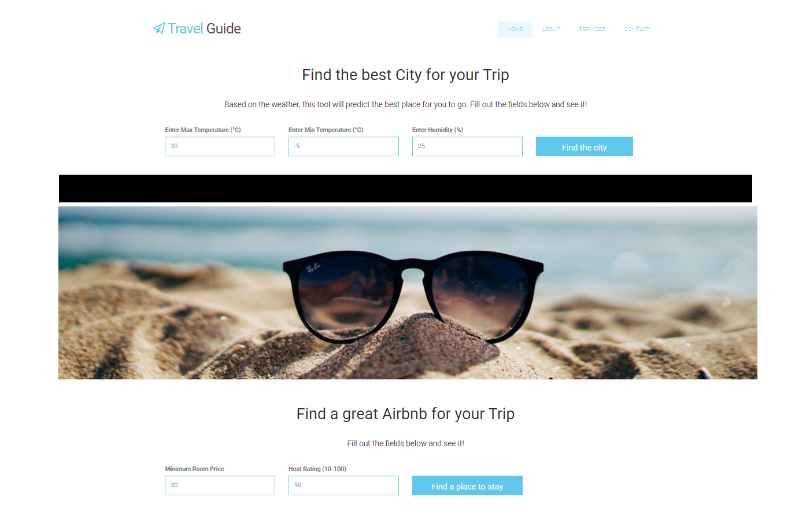

# Travel Guide
What is the most popular destinations for Canadians? Pick your dates and preferences and have fun!

Our goal is to provide suggestions for travel destinations based on criteria that the user will select. Users will be able to choose the following: 
<li>Weather</li>
<li>Price Range</li>
<li>Min/Max temperature</li>
<li>Level of humidity</li>
<li>Average price/night</li>
<li>Airbnb rating</li>
<li>etc..</li>

Based on this information, we will predict the most suitable location destination and we will suggest Airbnb options that satisfy the user’s needs.

## Technical Tools to be Used
<li>Python: read data sources,weather API, merge and clean data, ETL process</li>
<li>Scikit_Learn - Predict future weather and potential airbnb listings</li>
<li>Heroku to Deploy the App</li>
<li>HTML, CSS, JavaScript, Bootstrap to create the Webpage</li>

## Datasets:
<li> Listings: http://insideairbnb.com/get-the-data.html</li>
<li> Weather: https://www.visualcrossing.com/</li>

## Group Members:

-	Marina Ercoli 
-	Jorge Arriola Villafuerte
-	Ulisses Pinto 
-	Monica Lin 
-	Emilia Lubanska – Oledzka
-	Fatima Mukaddam

## Visualizations:

## Live webpage
TBD
### Copyright
